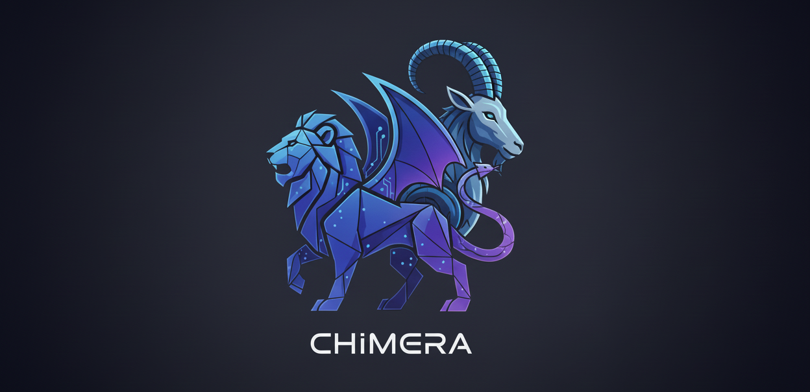

# Chimera Engine

Chimera Engine is a specialized, data-driven, and highly modular C-based framework designed for the creation of procedurally generated, turn-based games with deep, systemic simulation.

## Core Features

*   **Systemic Simulation Core:** Powered by the Flecs ECS framework to enable deep, emergent gameplay.
*   **Data-Driven by Design:** All aspects of the engine, from entity creation to world generation, are driven by external data files, making it highly moddable.
*   **Decoupled & Agnostic:** A clean C API with a modular architecture, including a swappable backend for rendering and input (currently using Raylib).
*   **Turn-Based Focus:** A built-in Command Pattern game loop perfect for creating complex, turn-based roguelikes.

## Getting Started

### The Easy Way (Recommended)

This repository includes a complete Dev Container configuration. This is the fastest and most reliable way to get a fully-configured development environment.

1.  Make sure you have Docker, VS Code, and the [Dev Containers extension](https://marketplace.visualstudio.com/items?itemName=ms-vscode-remote.remote-containers) installed.
2.  Clone the repository: `git clone --recurse-submodules https://github.com/thomashodgkinson1987/chimera-engine.git`
3.  Open the cloned folder in VS Code.
4.  When prompted, click "**Reopen in Container**".

VS Code will automatically build the Docker image and launch a terminal inside the container with all dependencies pre-installed. You can then proceed to the build steps.

### The Manual Way (Native Build)

If you prefer to build on your host machine, you will need to install the following dependencies.

**Core Build Tools:**
*   A C11-compliant compiler (e.g., `gcc`, `clang`)
*   `cmake` (version 3.10 or higher)
*   `git`

**Raylib Dependencies:**
Raylib requires a number of graphics and audio libraries to be installed (e.g., OpenGL, ALSA, and various X11 development libraries on Linux).

Please consult the official [Raylib wiki](https://github.com/raysan5/raylib/wiki/Working-on-GNU-Linux) for the correct package names for your specific distribution. For a definitive list of packages used in our reference environment, see the `Dockerfile`.

### Building the Engine

*These instructions are for a typical Linux debug build from within the project's root directory.*

1.  **Configure CMake:**
    ```bash
    cmake -S . -B build -DCMAKE_BUILD_TYPE=Debug
    ```
2.  **Build the code:**
    ```bash
    cmake --build build
    ```
3.  **Run the executable:**
    The final executable will be located in a path structured by OS and build type. For this example, you would run:
    ```bash
    ./build/Linux/Debug/bin/ChimeraEngine
    ```

## For Contributors & Deeper Dives

This project maintains a high standard of internal documentation for developers and contributors. To learn more, please see the following documents:

*   **[Project Overview (`PROJECT-OVERVIEW.md`)]:** The detailed architectural blueprint of the engine.
*   **[Prophesy (`/.isaiah/PROPHESY.md`)]:** The long-term vision and guiding principles for the project.
*   **[Style Guide (`STYLE-GUIDE.md`)]:** Our coding and Git contribution standards.
*   **[Milestones (`MILESTONES.md`)]:** The high-level development roadmap.

## License

Chimera Engine is licensed under the **LGPLv3**. Please see the `LICENSE` file for the full text.

The licenses for all third-party dependencies are aggregated in the `THIRD-PARTY-LICENSES.md` file.
